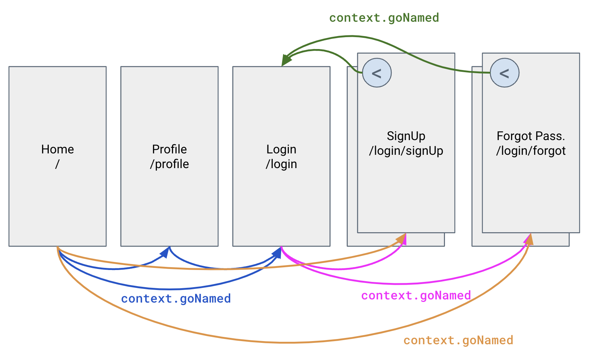

# Go Router Tutorial

This project with its tags will form the base for following the videos in YouTube 
at [Flutter Go Router Tutorial](https://www.youtube.com/playlist?list=PLyK2hHQDMu7BxJxC6B7m26YVMcCkXOsuQ)

## Part 1 - Simple Go Router implementation

In this part, we do the most basic implementation of a `go_router` where we have 3 pages `home`, `profile`, and `login` at the same level and `login` page has two more pages that are pushed on it `signUp` and `forgot`.

This version will be designated as `Part1` in the tags.

