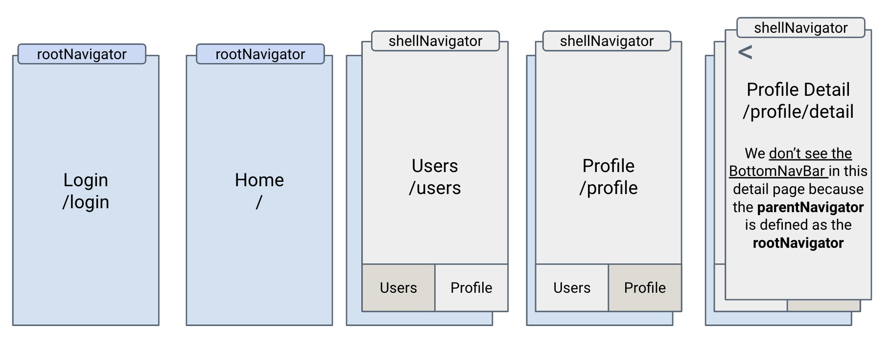
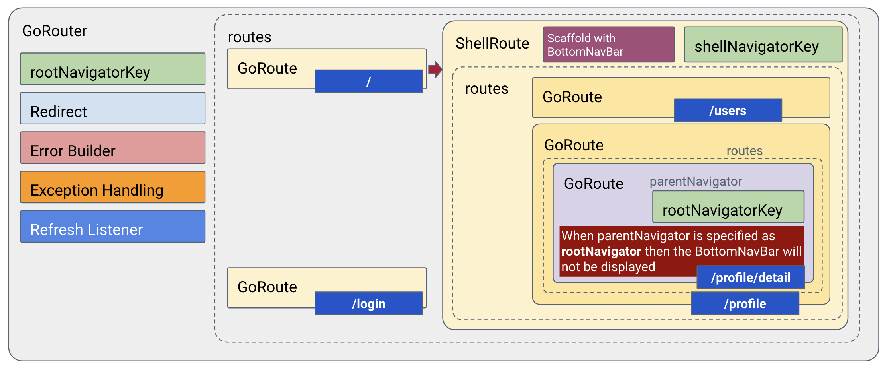

# Go Router Tutorial

This project with its tags will form the base for following the videos in YouTube 
at [Flutter Go Router Tutorial](https://www.youtube.com/playlist?list=PLyK2hHQDMu7BxJxC6B7m26YVMcCkXOsuQ)

## Part 1 - Simple Go Router implementation

In this part, we do the most basic implementation of a `go_router` where we have 3 pages `home`, `profile`, and `login` at the same level and `login` page has two more pages that are pushed on it `signUp` and `forgot`.

This version will be designated as `Part1` in the tags.

## Part 2 - Nested Go Router implementation with ShellRoute

In this part, we extend the basic implementation with a `ShellRoute` allowing us to do **Nested Navigation**. Our three pages `home`, `profile`, and `login` are at the same level.  The added nested navigation is attached to the `home` page which has a **child** route that is a `ShellRoute`. This child route can either be invoked by `/users` or `/profile`. In either case, they are presented via the `ShellRoute` such that a `BottomNavigationBar` is displayed. The structure is shown below:

the corresponding structure of the `GoRouter` object is:

This version will be designated as `Part2` in the tags.

